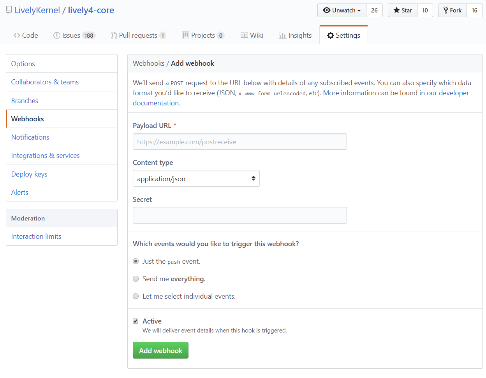

## 2019-01-30 #WebHook


### Idea: We should forward push and other events to lively-kernel.org

... and allow our clients to subscribe there. This would make it possible to update content in a running lively4 instance based on a remote commit.

- <https://github.com/LivelyKernel/lively4-core/settings/hooks/new> 
 
 
### Implementation


<https://lively-kernel.org/lively4/lively4-server/src/httpServer.js>


```javascript
  static webhookListeners(key) {
    if (!this.webhookListeners) {
      this.webhookListeners = new Map()
    }
    var set = this.webhookListeners[key]
    if (!set) {
      set = new Set()
      this.webhookListeners[key] = set
    }
    return set
  }
  
  static async WEBHOOK(pathname, req, res) {
    
    if (pathname.match("/_webhook/register")) {
      let key =  req.headers['repositoryname']; 
      log("webhook register " + key)
      
      this.webhookListeners(key).add({
        response: res
      })
      // do not answer it... do a long poll
      
      // res.writeHead(200); // done
      // res.end();

    } else if(pathname.match("/_webhook/signal")) {
   
      log("webhook signal ", req.headers)
      var body = '';
      req.on('data', (data) => {
          body += data;
      });
      req.on('end', () => {

        try {
          var json = JSON.parse(body)
        } catch(e) {  
          res.writeHead(400); // done
          res.end("could not parse: " + body);
        }
        if (json) {
          var key = json.repository.full_name
          var listeners = this.webhookListeners(key)
          log("found listeners: " + listeners.size)
          Array.from(listeners).forEach(ea => {
            var response = ea.response
            if (response) {
              log("answer " + response)
              response.writeHead(200); // answer long poll 
              response.end(JSON.stringify(json));              
            }
            listeners.delete(ea)
          })
          res.writeHead(200); // done
          res.end("");  
        }
      });      
    } else {
      log("webhook: " + pathname)
      res.writeHead(404); // not 
      res.end();
    }    
  }
```

### Lively client side long poll

```javascript                                          
fetch("https://lively-kernel.org/lively4S2/_webhook/register", {
  method: "GET",
  headers: {
    repositoryname: "LivelyKernel/lively4-core"
  }
}).then(r => r.text())
```


#### Github Side

```javascript
fetch("https://lively-kernel.org/lively4S2/_webhook/signal", {
  method: "PUT",
  headers: {
    'content-type': 'application/json',
  },
  body: JSON.stringify({
    repository: {
      "full_name": "LivelyKernel/lively4-core"
    }
  })
})
```