<!-- markdown-config presentation=true -->

<link rel="stylesheet" type="text/css" href="../../../doc/presentation/style.css"  />
<link rel="stylesheet" type="text/css" href="../../../src/client/lively.css"  />
<link rel="stylesheet" type="text/css" href="../../../templates/livelystyle.css"  />

{style="position:absolute; top:40px; left:40px; width:400px; border: 1px solid lightgray"}

---

{style="position:absolute; top:40px; left:40px; width:400px; border: 1px solid lightgray"}

{style="position:absolute; top:50px; left:450px; width:500px; border: 1px solid lightgray"}

---

{style="position:absolute; top:40px; left:40px; width:400px; border: 1px solid lightgray"}

{style="position:absolute; top:50px; left:450px; width:500px; border: 1px solid lightgray"}

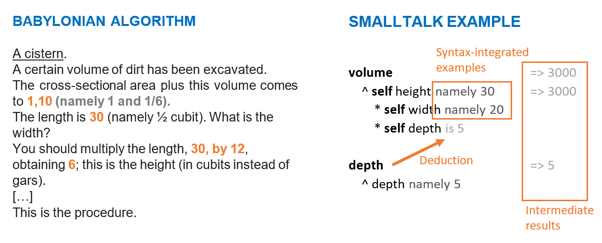{style="position:absolute; top:290px; left:130px; width:800px; border: 1px solid lightgray"}

---

{style="width: 200px; position: absolute; right: 20px;  bottom: 20px;"}

<a class="plain" href="https://arxiv.org/pdf/1902.00549">
Babylonian-style Programming 
</a>

Design and Implementation of a General-purpose Editor Supporting the Integration of Live Examples into Source Code

David Rauch, Patrick Rein, Stefan Ramson, <u>Jens Lincke</u>, and Robert Hirschfeld

   
  <a class="plain" href="https://www.hpi.uni-potsdam.de/hirschfeld/">Software Architecture Group 
Hasso Plattner Institute, University of Potsdam, Germany</a>
   
   
  <a class="plain" href="https://2019.programming-conference.org/"><b>‹Programming› 2019  Mon 1 - Thu 4 April 2019 Genoa, Italy</b></a>

<!---

---

## Motivation -  Classic (Application) Programming Workflow

{.centered}

---

## Motivation -  Classic (Application) Programming Workflow

{.centered}

---

## Motivation - Live (Application) Programming Workflow

{.centered}
-->

---
# Motivation 
## Classic (Application) Programming Workflow {.sub}

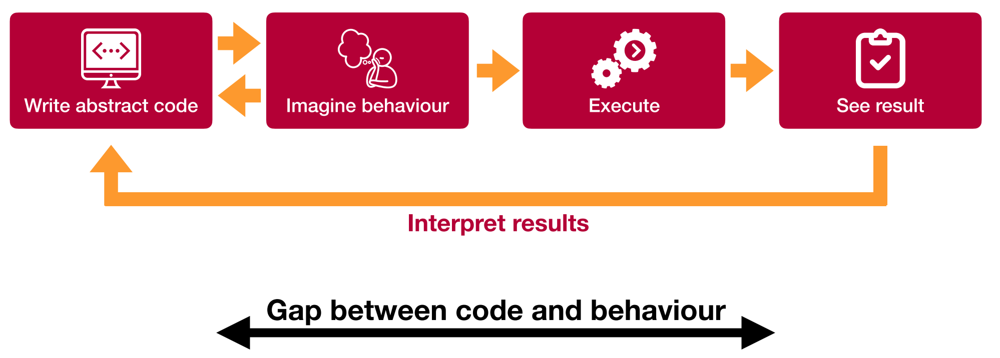{.centered}

<!-- Gap between code and behavior -->

---
# Motivation
## Live (Application) Programming Workflow {.sub}

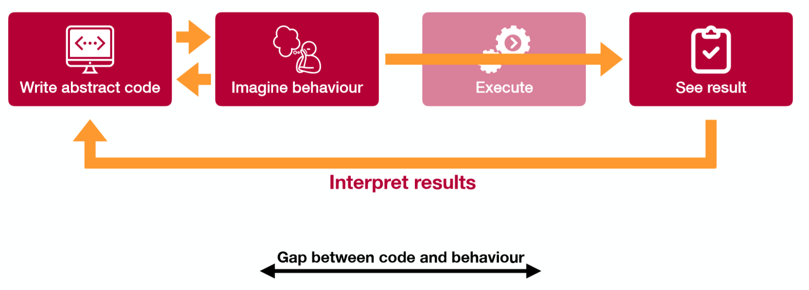{.centered}

---
# Motivation
## Example-based (Application) Programming Workflow {.sub}

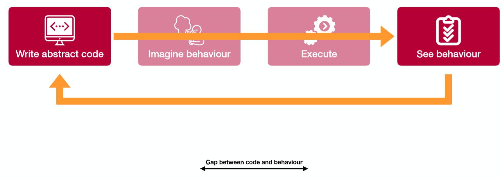

<!--
# Motivation
## Concrete Examples vs Abstract Code {.sub}

---
-->

---
# Motivation
## Existing Example-based Systems {.sub}

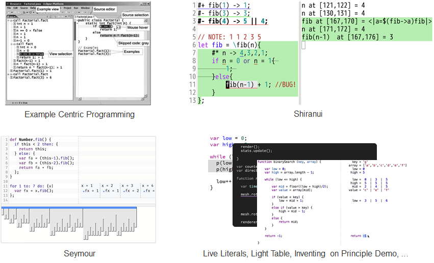{.centered}

---
# Approach

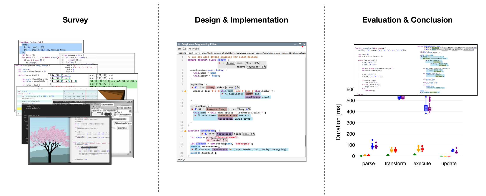{.centered}

---
# Survey

- Survey of 8 existing solutions 
  - Only 4 with “explicit” examples
- Many focus on specific domain 
- Most only for small programs
- Identify: 
  - Common patterns 
  - Limitations and features

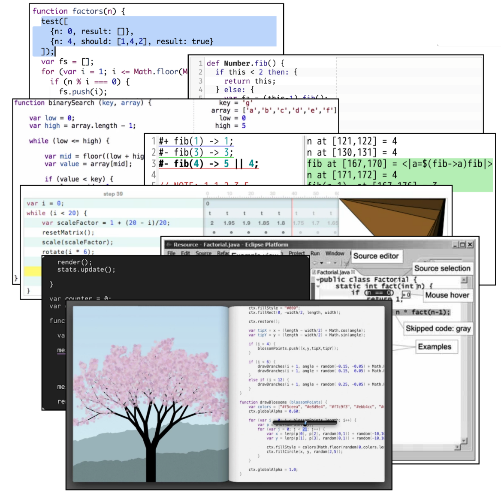{.right}

---
# Survey
## Feature Space for Example-based Systems {.sub}

Example: Set of input values for a function/method (example invocation) 

- Feedback on runtime state
  - Feedback granularity
  - State over time
  - State over modules
  - Arbitrary objects
  - Domain-specific feedback
- Associating examples with code
  - Multiple examples for one part of the application
  - Reusing parts of examples	

{style="width:45%; float: left"}

- Specifying context
- Determining relevant sections of code
  - Control flow
  - Runtime state
  - Program output
- Keeping track of assumptions {style="margin-top:10px"}
- Navigating the trace{style="margin-top:10px"}

{style="width:45%; float: left"}

---
## Survey - Results

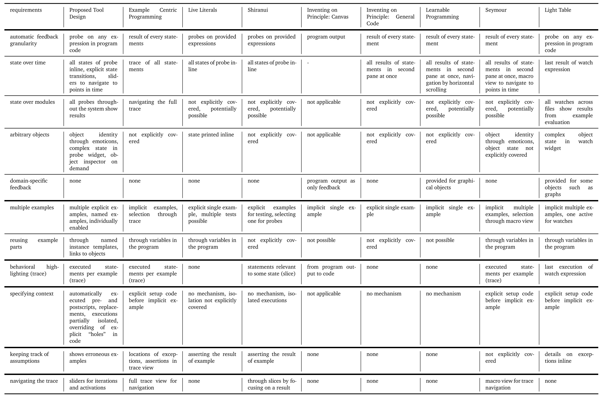

--- 
## Survey -  Identified Features

<!--

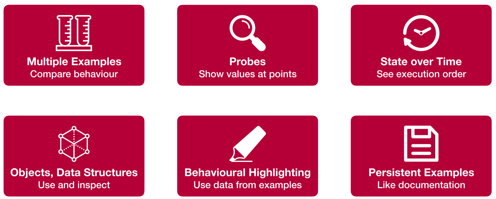{.centered}

-->

<lively-drawio src="./survey-features.xml"></lively-drawio>{.centered}

---
# Approach
## Babylonian-style Programming Editor {.sub}

<!--
{.centered}

Live results for a concrete implementation (left) and an abstract implementation with live examples (right)
-->

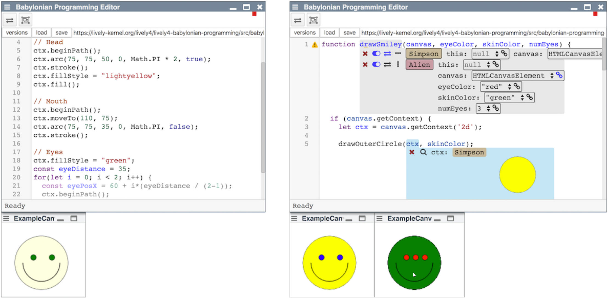{.centered}

---
# Design

- Single panel 
  - Behavioral information inline
- Editor integration 
  - Annotations are UI widgets
- Multiple editors 
  - Follow examples across modules

{.right}

---
# Design
## Multiple Examples {.sub}

- Multiple examples per function 
- May be activated or deactivated 
- Named examples 
- Assigned colors

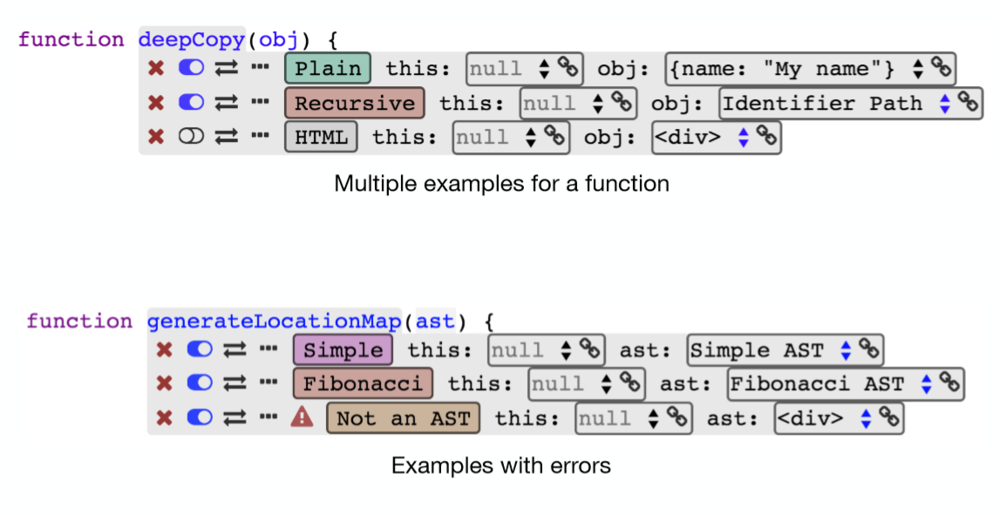{.right}

---
# Design
## Probes  {.sub}

- Probe source code for values 
- Attach to syntax elements 
- See values for examples 
- See changes during statement 
- Chronological order 
- Object inspector supported

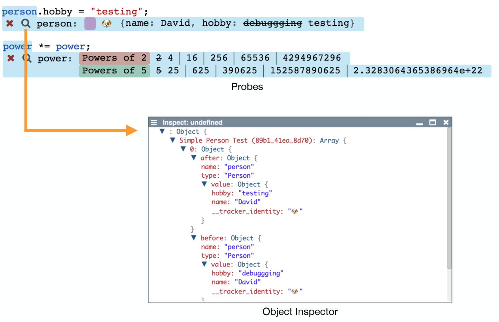{.right}

--- 
# Design
## State over Time  {.sub}

- Sliders 
- Attach to flow control structures 
- Scroll through iterations 
- Probes filter values 
- Easier correlation of values

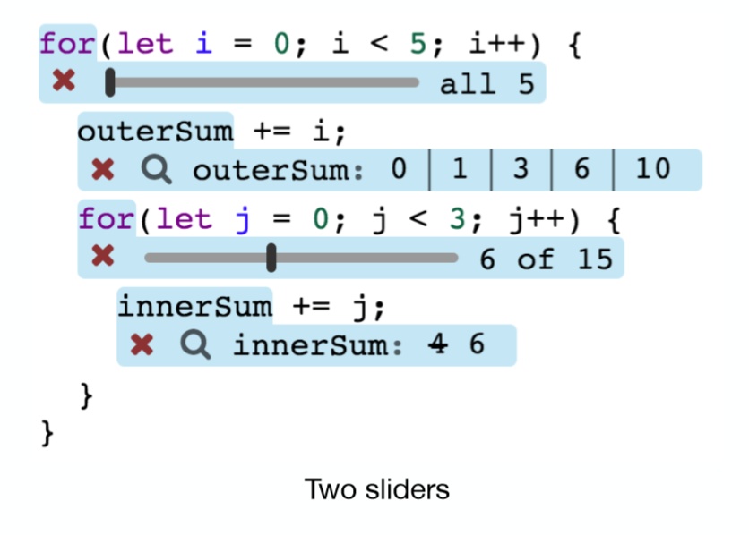{.right}

--- 
# Design
## Objects and Data Structures  {.sub}

- Supported by probes 
- Usable in examples 
- (Custom) instance templates 
- Links

{.bottomLeft}
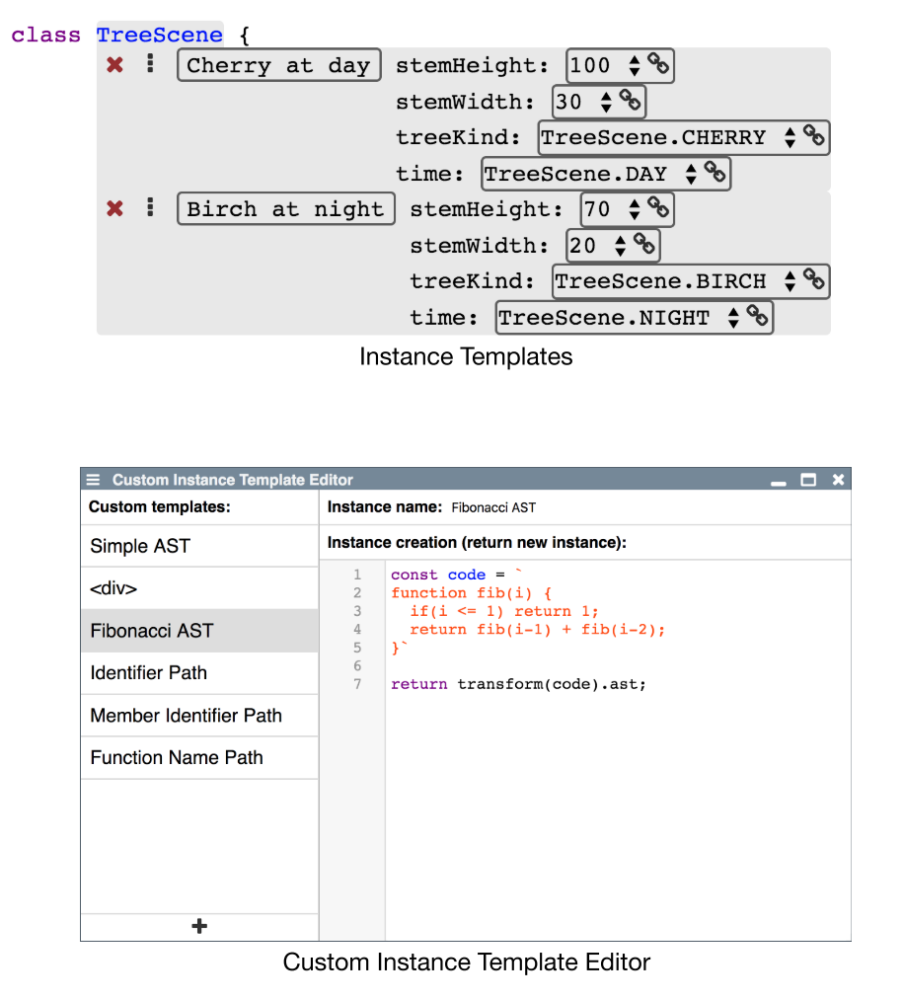{.right}

<!-- #TODO source: @rhi, Fibonacci -> similar.... -->

---
# Design
## Behavioral Highlighting  {.sub}

- Examples indicate intent 
- Fade out code that was not reached 
- Quickly find relevant code 
- Examine conditions without probes

{.right}

<!-- Behavioral highlighting for a conditional -->

---
# Design
## Persistent Examples  {.sub}

- Serialized to JSON 
- Saved as comments 
- Before and after syntax elements
- On load: parse and hide

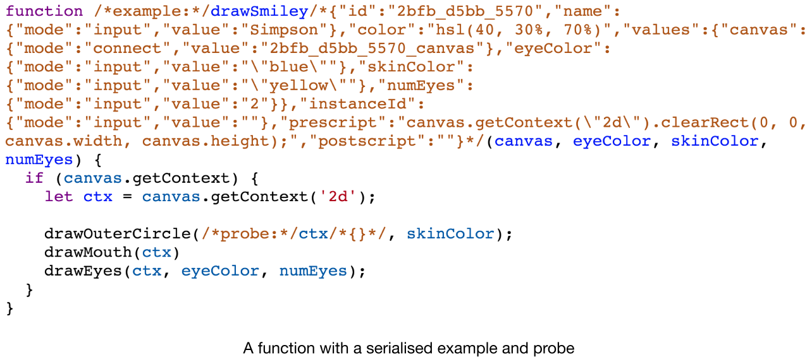{.right}

---
# Design
## Additional Features  {.sub}

- Replacements 
  - Replace source code 
  - Only for example evaluation
- Pre- and postscript 
  - Run before and after example 
  - Similar to setup and teardown

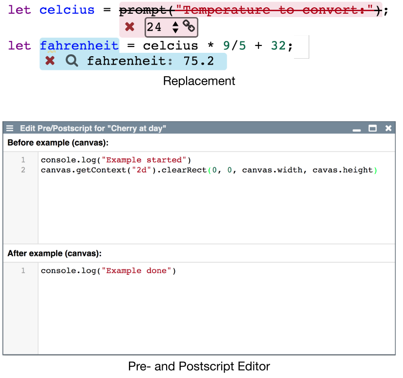{.right}

---
# Demo
## Babylonian-style Programming Editor {.sub}

<!--

-->

{style="width: 600px; position: absolute; top: 180px; right: 20px"}

- [demos](browse://src/babylonian-programming-editor/demos/)
- [binary search](edit://src/babylonian-programming-editor/demos/binary-search.js)
- [tree-scene](edit://src/babylonian-programming-editor/demos/tree-scene.js)
  - [tree-base](edit://src/babylonian-programming-editor/demos/tree-base.js)
- [utils/ast](edit://src/babylonian-programming-editor/utils/ast.js)
  - [location-converter.js](edit://src/babylonian-programming-editor/utils/location-converter.js)

<!--

this.drawBranches(ctx, random, i+2, angle + random(0.3, 0.6), tipX + 1, tipY, width)

-->

---
# Implementation 

- Implemented and integrated in Lively4 web-based development environment
- CodeMirror-based
- Executed when user stops typing

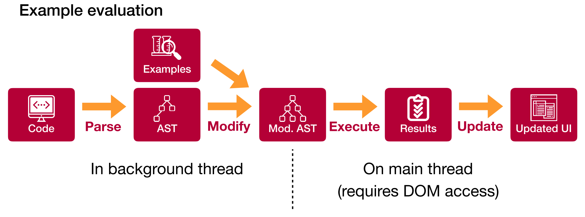

---
# Future Work

- **Projectional Editing:** Persistent AST 
- **Example Execution Paths:** How did an example reach a certain point?
- Non-terminating Examples: How to support? 
- Non-“deep” systems: How to realize complex features? 
- Unit Tests: How to integrate examples and unit tests?

---
# Conclusion

- Integrated live examples into source code of complex applications
- Surveyed existing systems 
- **Designed and implemented a new editor**
- **Evaluation: Editor enables new use-cases**
- Focus on complex applications opens new research questions

---
# Babylonian-style Programming Editor

- Feedback on runtime state
  - Feedback granularity
  - State over time
  - State over modules
  - Arbitrary objects
  - Domain-specific feedback
- Associating examples with code
  - Multiple examples for one part of the application
  - Reusing parts of examples	
- Specifying context
- Determining relevant sections of code
  - Control flow
  - Runtime state
  - Program output
- Keeping track of assumptions {style="margin-top:10px"}
- Navigating the trace{style="margin-top:10px"}

{style="transform: scale(0.8); transform-origin: top left; width:45%; float: left"}

{style="width: 550px; position: absolute; top: 200px; right: 20px"}

---

Backup Slides

--- 
# Implementation
## AST Transformation{.sub}

---

# Evaluation

- Editor features 
  - Binary Search 
  - Canvas
- Editor performance 
  - Responsiveness in different scenarios

---
# Evaluation
## Performance {.sub}

- Baseline: empty 
- Simple: 
  - Binary search implementation 
  - 3 examples, 4 probes, 1 slider
- Complex: 
  - 700 LoC 
  - 8 examples, 11 probes, 1 slider

{#EvaluationPerformance}

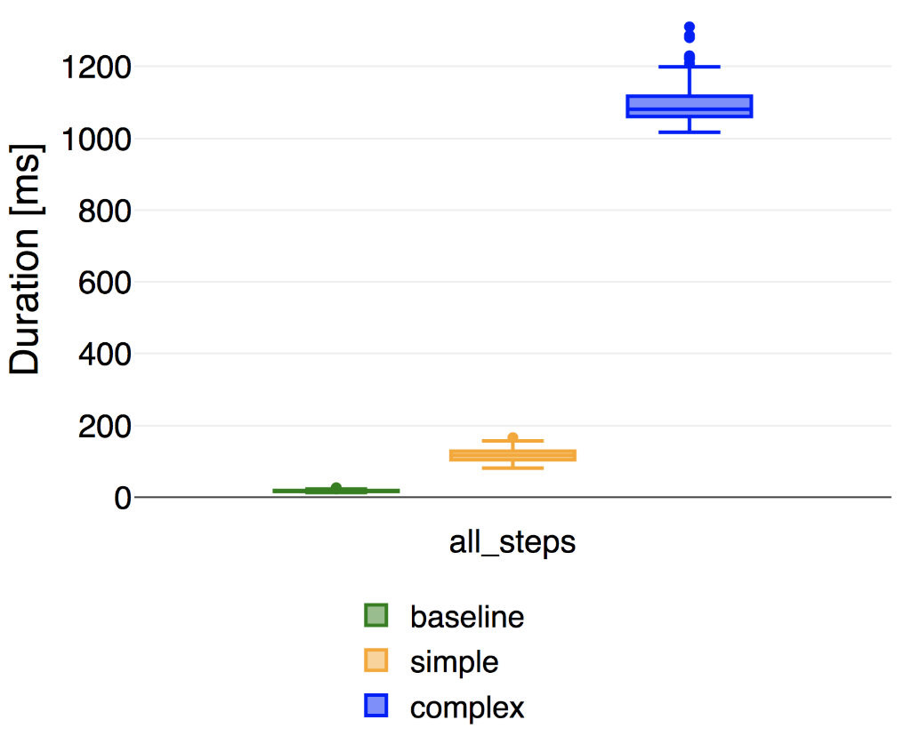{.right}

---
# Evaluation
## Performance {.sub}

<!-- #TODO extract copy element as behavior into a component -->

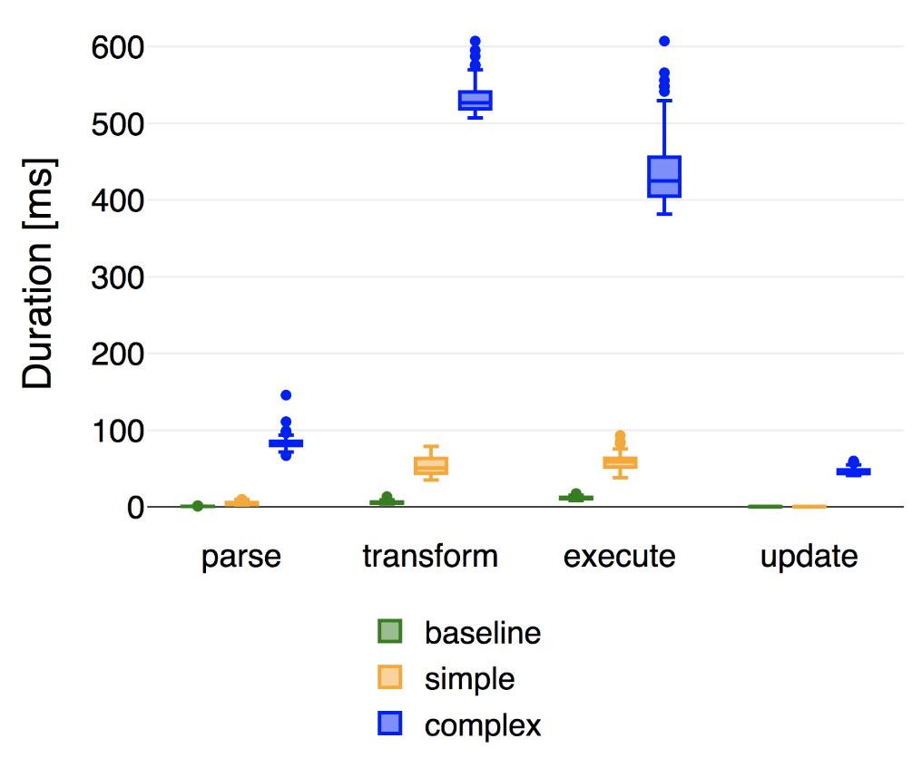{.right}

---
<!-- #TODO pull this up into presentation? -->
