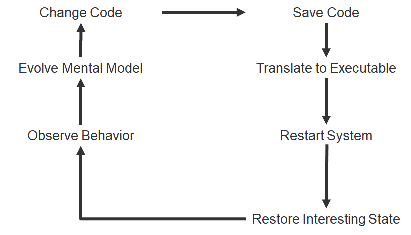
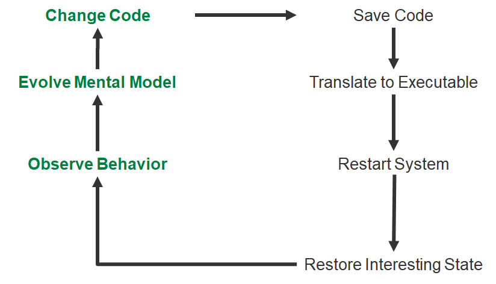

<!-- markdown-config presentation=true -->

<link rel="stylesheet" type="text/css" href="../../../doc/presentation/style.css"  />
<link rel="stylesheet" type="text/css" href="../../../src/client/lively.css"  />
<link rel="stylesheet" type="text/css" href="../../../templates/livelystyle.css"  />

{style="width: 200px; position: absolute; right: 20px;  bottom: 20px;"}

<a class="plain" href="https://arxiv.org/pdf/1902.00549">
Babylonian-Style Programming 
</a>

Design and Implementation of a General-purpose Editor Integrating Live Examples Into Source Code

David Rauch, Patrick Rein, Stefan Ramson, Jens Lincke, and Robert Hirschfeld

   
  <a class="plain" href="https://www.hpi.uni-potsdam.de/hirschfeld/">Software Architecture Group 
Hasso Plattner Institute, University of Potsdam, Germany</a>
   
   
  <a class="plain" href="https://2019.programming-conference.org/"><b>‹Programming› 2019  Mon 1 - Thu 4 April 2019 Genoa, Italy</b></a>

----
## The Long Loop

{.centered}

---

## The Long Loop

{.centered}

---

## Live Programming

{.centered}

---
## Concrete Examples vs Abstract Code

{.centered}

Live results for a concrete implementation (left) and an abstract implementation with live examples (right)

---

## Existing Example-based Systems

{.centered}

---
## Feature Space for Example-based Systems

Example: Set of input values for a function/method (example invocation) 

- Feedback on Runtime State
  - Feedback granularity
  - State over time
  - State over modules
  - Arbitrary objects
  - Domain-specific feedback
- Associating Examples with Code
  - Multiple examples for one part of the application
  - Reusing parts of examples	

{style="width:45%; float: left"}

- Specifying Context
  - Determining Relevant Sections of Code
  - Control flow
  - Runtime state
  - Program output
- Keeping Track of Assumptions {style="margin-top:10px"}
- Navigating the Trace{style="margin-top:10px"}

{style="width:45%; float: left"}

---
## Babylonian-Style Programming Editor

{.centered}

---
## Demo

<!--

-->

{.centered}

<browse://src/babylonian-programming-editor/demos/>

<!--

this.drawBranches(ctx, random, i+2, angle + random(0.3, 0.6), tipX + 1, tipY, width)

-->

---
## Babylonian-Style Programming Editor

- Feedback on Runtime State
  - Feedback granularity
  - State over time
  - State over modules
  - Arbitrary objects
  - Domain-specific feedback
- Associating Examples with Code
  - Multiple examples for one part of the application
  - Reusing parts of examples
- Specifying Context
- Determining Relevant Sections of Code
  - Control Flow
  - Runtime State
  - Program Output
- Keeping Track of Assumptions
- Navigating the Trace

{style="transform: scale(0.8); transform-origin: top left; width:45%; float: left"}

{style="width: 500px; position: absolute; bottom: 40px; right: 20px"}

---

---
<!-- #TODO pull this up into presentation? -->
